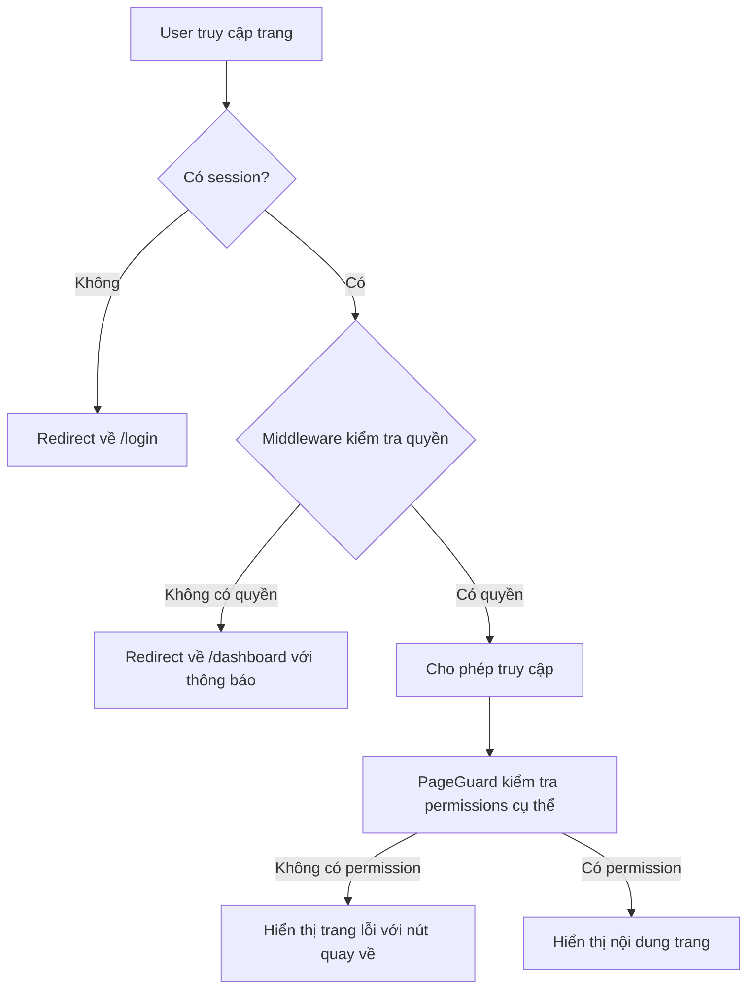

# 🔐 Logic Phân quyền Mới - Tối ưu UX

## 🎯 **Vấn đề đã sửa:**

**❌ Logic cũ (không hợp lý):**
- User đã đăng nhập nhưng không có quyền xem trang
- PageGuard hiển thị trang lỗi với nút "Quay về Dashboard"
- User phải click để quay về → UX không tốt

**✅ Logic mới (tối ưu):**
- User đã đăng nhập nhưng không có quyền xem trang
- **Tự động redirect về Dashboard ngay lập tức**
- Không cần user thao tác gì → UX tốt hơn

## 🛡️ **Cách hoạt động:**

### 1. **Middleware (Server-side)**
```typescript
// Kiểm tra quyền truy cập trang ở server level
if (session && protectedRoutes.some(route => pathname.startsWith(route))) {
  const userRole = req.cookies.get('user_role')?.value || 'employee'
  const allowedPages = ROLE_ALLOWED_PAGES[userRole] || []
  const hasPageAccess = allowedPages.includes(pathname) || 
    allowedPages.some(page => pathname.startsWith(page))
  
  if (!hasPageAccess) {
    // Redirect về dashboard với thông báo
    const redirectUrl = new URL('/dashboard', req.url)
    redirectUrl.searchParams.set('accessDenied', 'true')
    redirectUrl.searchParams.set('requestedPath', pathname)
    return NextResponse.redirect(redirectUrl)
  }
}
```

### 2. **PageGuard (Client-side)**
```typescript
// Redirect về dashboard nếu không có quyền truy cập trang
useEffect(() => {
  if (user) {
    const allowedPages = ROLE_ALLOWED_PAGES[user.role_name || 'employee'] || []
    const hasPageAccess = allowedPages.includes(window.location.pathname) || 
      allowedPages.some(page => window.location.pathname.startsWith(page))
    
    if (!hasPageAccess) {
      router.push(fallbackPath) // Mặc định là '/dashboard'
      return
    }
  }
}, [user, router, fallbackPath])
```

## 📊 **Luồng xử lý:**



## 🎨 **UX Improvements:**

### **Trước (Logic cũ):**
1. User click vào link không có quyền
2. Trang load → Hiển thị trang lỗi
3. User phải click "Quay về Dashboard"
4. **Tổng: 2 bước, cần thao tác**

### **Sau (Logic mới):**
1. User click vào link không có quyền
2. **Tự động redirect về Dashboard**
3. **Tổng: 1 bước, không cần thao tác**

## 🔧 **Các trường hợp xử lý:**

### **1. Không có quyền truy cập trang (Page Access)**
- **Middleware**: Redirect về `/dashboard?accessDenied=true&requestedPath=/forbidden-page`
- **PageGuard**: Redirect về `/dashboard` (fallbackPath)
- **Dashboard**: Hiển thị thông báo "Không có quyền truy cập"

### **2. Không có permission cụ thể (Specific Permission)**
- **PageGuard**: Hiển thị trang lỗi với thông tin chi tiết
- **User**: Có thể click "Quay về Dashboard" hoặc "Quay lại trang trước"

### **3. Không có role cụ thể (Specific Role)**
- **PageGuard**: Hiển thị trang lỗi với thông tin role
- **User**: Có thể click "Quay về Dashboard"

## 📝 **Ví dụ sử dụng:**

```tsx
// Trang chỉ dành cho Admin
<PageGuard 
  requiredPermissions={['roles:manage']}
  requiredRole="admin"
  pageName="Quản lý Roles"
>
  <RoleManagementContent />
</PageGuard>

// Trang với permission cụ thể
<PageGuard 
  requiredPermissions={['customers:create']}
  pageName="Tạo khách hàng"
>
  <CreateCustomerForm />
</PageGuard>
```

## 🚀 **Lợi ích:**

1. **UX tốt hơn**: Tự động redirect, không cần thao tác
2. **Bảo mật cao**: Kiểm tra ở cả server và client
3. **Thông báo rõ ràng**: User biết tại sao bị từ chối
4. **Linh hoạt**: Có thể tùy chỉnh fallbackPath
5. **Performance**: Redirect nhanh, không load trang không cần thiết

## 🎯 **Kết luận:**

Logic mới đã tối ưu UX bằng cách:
- ✅ **Tự động redirect** khi không có quyền truy cập trang
- ✅ **Hiển thị thông báo** trên Dashboard
- ✅ **Giữ nguyên logic** cho permissions cụ thể
- ✅ **Không cần thao tác** từ user

Hệ thống phân quyền giờ đây hoạt động mượt mà và thân thiện với người dùng! 🎉
